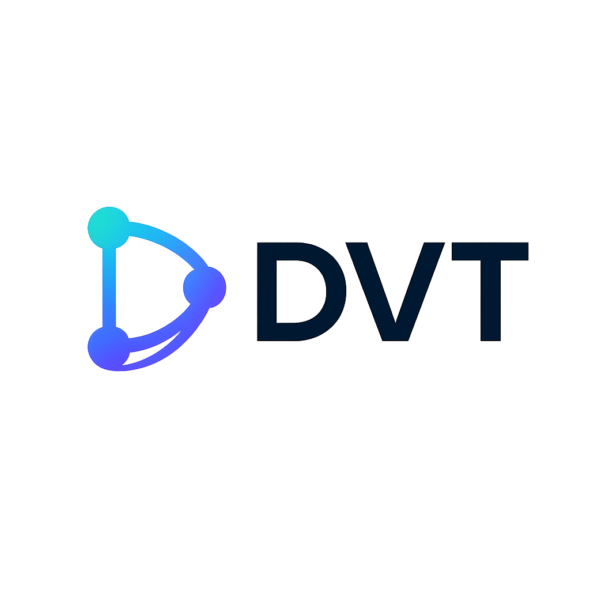

# DVT Frontend



Frontend application for **DVT (Denvic Visual Transformer)** — a visual ETL platform for designing, configuring, and running data pipelines through a node-based editor.

This repository contains the DVT web UI. The canonical source repository is `https://github.com/Denvic-Tech/dvt-ui`; private GitLab copies are read-only CI mirrors and are not used for development or merge requests. The DVT backend is maintained separately and provides authentication, projects, pipeline execution, metadata, storage, extension APIs, realtime events, and the OpenAPI contract consumed by this frontend.

## Features

- Visual node-based pipeline editor powered by `@xyflow/react`
- Project and connection management
- Rich editors for ETL nodes and node metadata
- Realtime execution state through WebSocket events
- Runtime configuration and system status UI
- Extensible node UI through the DVT Extension frontend host
- Generated TypeScript API client based on the DVT backend OpenAPI schema

## Tech stack

- React 18
- TypeScript
- Vite
- Redux Toolkit
- Material UI / MUI X
- Mantine
- `@xyflow/react`
- React Hook Form
- Zod
- Axios
- Vitest

## Requirements

- Node.js 22 or newer recommended
- npm
- A running DVT backend for normal application use

The project Dockerfile currently builds with Node.js `22.13.0`.

## Local development

### 1. Install dependencies

```bash
npm ci
```

### 2. Configure the backend URL

Create a local `.env` file in the repository root. It is ignored by Git.

```dotenv
VITE_API_BASE_URL=http://localhost:8200/api
```

Optional Vite development-server settings:

```dotenv
VITE_HOST=localhost
VITE_PORT=5173
```

Do not commit credentials, tokens, API keys, or environment-specific secrets.

### 3. Start the development server

```bash
npm run dev
```

By default, Vite serves the frontend at `http://localhost:5173`.

For production builds, the frontend uses `/api` on the same origin rather than the development `VITE_API_BASE_URL` value.

## Build

```bash
npm run build
```

Preview the production bundle locally:

```bash
npm run preview
```

The generated production bundle is written to `dist/`.

## Tests and code quality

Run the unit/component test suite:

```bash
npm run test:run
```

Run linting:

```bash
npm run lint
```

Check formatting:

```bash
npm run format:check
```

On Windows, if Vitest cannot start its bundled esbuild binary, see the testing notes in [`AGENTS.md`](AGENTS.md).

## API client generation

The frontend uses an autogenerated gateway client located in:

```text
src/shared/gatewayClient/client.gen/
```

The backend must expose the core OpenAPI document at:

```text
${VITE_API_BASE_URL}/openapi-core.json
```

With `VITE_API_BASE_URL` configured in the local `.env` file, regenerate the client with:

```bash
npm run generate:gateway
```

Generated client files should not be edited manually. If the API contract needs to change, update the backend OpenAPI schema and regenerate the client.

## Repository structure

The application is organized primarily around Feature-Sliced Design principles:

```text
src/
├── app/              # Application composition, providers, routing, setup
├── entities/         # Domain entities and their state/API/UI
├── features/         # User-facing flows and use cases
├── widgets/          # Composite UI blocks
├── pages/            # Route-level pages
├── shared/           # Shared UI, generated API client, utilities and types
├── node-extensions/  # Core node-specific frontend extensions
└── edge-extensions/  # Core edge-specific frontend extensions
```

Some legacy modules are still being migrated toward the current architecture. See [`AGENTS.md`](AGENTS.md) for development conventions and architectural guidance.

## DVT Extensions

DVT supports separately distributed extensions. Extension frontend bundles are loaded by the application at runtime and register themselves through the documented DVT Extension host interface.

The core frontend exposes supported capabilities through `src/app/extensions/`. Extensions should use documented extension interfaces rather than depending on DVT internal implementation details.

Development helpers for creating node extensions are available under:

```text
.codex/skills/dvt-node-extension-builder/
```

## Docker

Build the standalone frontend image:

```bash
docker build -t dvt-ui .
```

The resulting image serves the production bundle through Nginx on port `80`.

In the complete DVT deployment, routing for `/api` is normally provided by the DVT reverse proxy / deployment configuration.

## Development guidance

Before contributing code, read [`AGENTS.md`](AGENTS.md). It documents the current architecture, API-client workflow, state-management conventions, extension boundaries, testing requirements, and coding style used by the project.

Useful commands:

```bash
npm run dev
npm run build
npm run test:run
npm run lint
npm run format:check
npm run generate:gateway
```

## License

DVT Core is licensed under the **GNU Affero General Public License v3.0 only (AGPL-3.0-only)**.

The complete AGPLv3 text is provided in [`LICENSE`](LICENSE). Additional DVT licensing terms, including the **DVT Extension Exception**, are provided in [`COPYING`](COPYING).

The DVT Extension Exception is an additional permission for qualifying DVT Extensions using documented DVT Extension interfaces. It does not change the AGPLv3 license of DVT Core itself.
